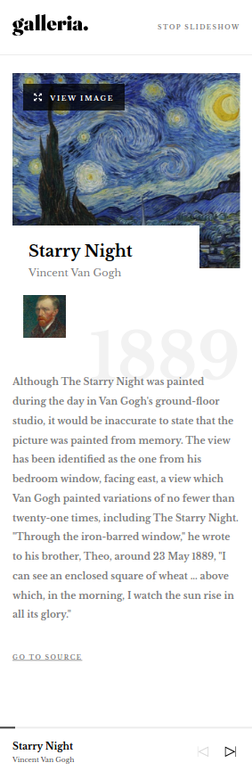

# Audiophile e-commerce website

This is a solution to the [Gallery slideshow site challenge on Frontend Mentor](https://www.frontendmentor.io/challenges/audiophile-ecommerce-website-C8cuSd_wx). Frontend Mentor challenges help you improve your coding skills by building realistic projects.

## Table of contents

- [Overview](#overview)
  - [The challenge](#the-challenge)
  - [Screenshots](#screenshots)
  - [Links](#links)
- [My process](#my-process)
  - [Built with](#built-with)
  - [What I learned](#what-i-learned)
  - [Continued development](#continued-development)
- [Author](#author)

## Overview

### The challenge

Users should be able to:

- View the optimal layout for the app depending on their device's screen size
- See hover states for all interactive elements on the page
- Navigate the slideshow and view each painting in a lightbox

### Screenshots

#### Mobile

#### Tablet

#### Desktop

### Links

- Live Site URL -> [https://igorbanjac91.github.io/galleria/](https://igorbanjac91.github.io/galleria/)

## My process

### Built with

- Semantic HTML5 markup
- SCSS
- Mobile-first workflow
- [React](https://reactjs.org/) - JS library

### What I learned

Improved workflow with React

### Continued development

- Run slidwshow automaticly 

## Author

- Website - [My portfolio](https://igorbanjac91.github.io/galleria/)
- Twitter - [@yourusername](https://twitter.com/banjac_igor)
